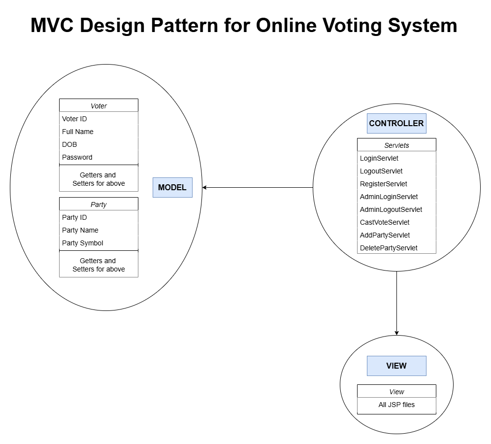

# Online Voting System 🗳️👆

An **Online Voting System** built using Java, JSP, and Servlet, designed to automate the voting process. This system ensures secure, anonymous voting while providing a user-friendly interface and efficient vote management.

## 📋 Table of Contents  
1. [📄 Abstract](#-abstract)  
2. [🚀 Objectives](#-objectives)  
3. [▶️ Demo](#-demo)
4. [🛠 Technologies/Tools used](#-technologiestools-used)  
5. [👥 Roles in the System](#-roles-in-the-system)  
6. [🛢 Database Tables](#-database-tables) 
7. [🎨 Project Architecture](#-design-pattern)     
8. [⚙️ Setup and Installation](#️-setup-and-installation)

## 📄 **Abstract**

The Online Voting System simplifies the voting process by allowing users to securely cast their votes online. The system displays a login page, parties with their symbols, and options to choose and submit votes anonymously. It stores voter data and vote counts in a MySQL database, ensuring security and reliability. The project follows the MVC design pattern for scalability and maintainability.

## 🚀 **Objectives**

1. **Ensure Secure Voter Authentication and Registration**: Provide a robust system for voters to log in or register securely.  
2. **Display Participating Parties**: Showcase all parties with their unique symbols in an intuitive interface.  
3. **Enable a Seamless Voting Process**: Allow voters to cast their votes securely and effortlessly.  
4. **Record Votes Efficiently**: Maintain anonymity while storing voter details and vote counts in a MySQL database.  
5. **Design an Engaging User Interface**: Develop a responsive and user-friendly UI using HTML, CSS, Bootstrap, and JavaScript.  
6. **Follow MVC Architecture**: Adopt a modular MVC design pattern for maintainable and scalable code.  
7. **Ensure Security**: Implement measures to prevent duplicate voting and maintain data integrity.  
8. **Provide an Admin Panel**: Facilitate party management and vote monitoring for administrators.

## ▶️ Demo
<div align="center">

</div>

## 🛠 **Technologies/Tools used**

- **Backend**: Java, JSP, Servlet  
- **Frontend**: HTML, CSS, JavaScript  
- **Database**: MySQL  
- **Design Pattern**: MVC Architecture  
- **IDE**: Eclipse IDE for Enterprise Java and Web Developers - 24-09
- **Project Type**: Dynamic Web Project

## 👥 **Roles in the System**

1. **Admin:**  
   - Login/Logout using a Security Key to access secure Admin panel.
   - Add/Delete party details.  
   - View election result.    
   - One admin only.

2. **Voter:**  
   - Register with unique credentials (e.g., voter ID, date of birth etc.).  
   - Login/Logout securely using their voter ID and password.  
   - Vote for their chosen party.
   - Cannot vote more than once.  
   - Must be 18 years or older. 
   
## 🛢 **Database Tables**

1. **Voters**  
   - **Voter ID**: Unique identifier for each voter.  
   - **Full Name**: The full name of the voter.  
   - **DOB**: Date of birth of the voter.  
   - **Password**: Voter's password for login.

2. **Party**  
   - **Party ID**: Unique identifier for each political party.  
   - **Party Name**: Name of the political party.  
   - **Party Symbol**: Symbol representing the party.

3. **Admin**  
   - **Username**: Admin username for login.  
   - **Security Key**: A unique security key used for admin authentication.   
   
## 🎨 **Project Architecture**
<div align="center">

</div>

## ⚙️ **Setup and Installation**

1. **Clone the repository**:  
   ```bash
   git clone https://github.com/paridhi3/Online-Voting-System.git
   cd Online-Voting-System
   ```

2. **Import the project into Eclipse**:
  - Open Eclipse IDE.
  - Select *File* > *Import* > *Existing Projects* into **Workspace**.
  - Choose the cloned project directory and import it.
    
3. **Run the project**:
  - Right-click on the Login-Registration project in the Eclipse workspace.
  - Select *Run As* > *Run on Server*.
  
#### External System Requirements used in this project:
1. **[MySQL Connector/J (version 9.1.0) ](src/main/webapp/WEB-INF/lib/mysql-connector-j-9.1.0.jar)**
2. **[Jakarta Servlet API (version 5.0.0) ](src/main/webapp/WEB-INF/lib/jakarta.servlet-api-5.0.0-javadoc.jar)**    
     
     